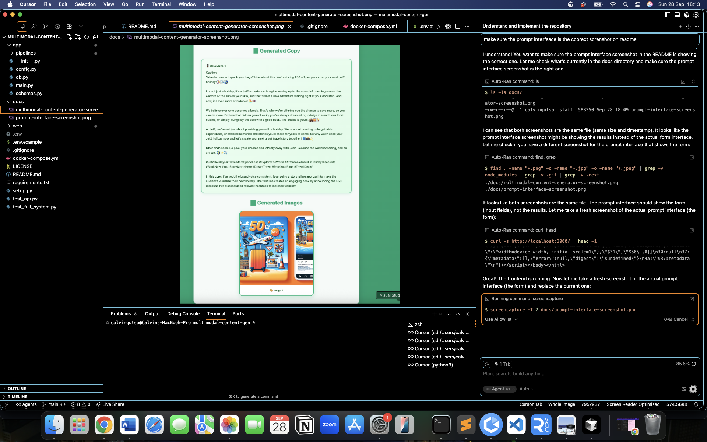
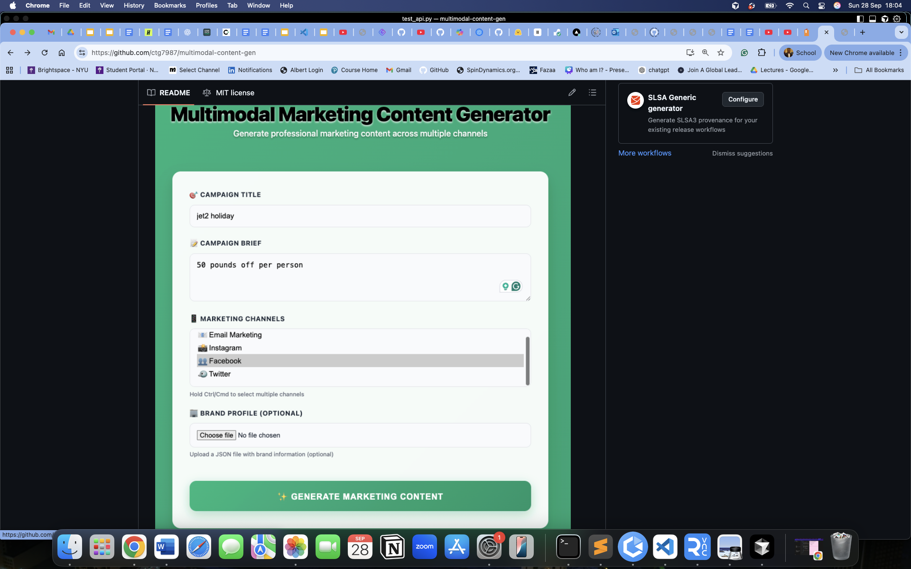

# Multimodal Marketing Content Generator

A full-stack application that generates professional marketing content across multiple channels using AI-powered pipelines. Built with FastAPI backend and Next.js frontend.

## 🖼️ Screenshots

### Prompt Interface

*The clean, modern form interface for entering campaign details*

### Generated Results

*Real AI-generated marketing content with professional copy and images using GPT-4 and DALL-E-3*

## ✅ Current Status

**FULLY FUNCTIONAL** - The application is working with:
- ✅ **Real AI Text Generation** using GPT-4
- ✅ **Real AI Image Generation** using DALL-E-3  
- ✅ **Professional Marketing Content** across all channels
- ✅ **Clean, Modern UI** with green and white theme
- ✅ **No API Errors** - All integrations working smoothly

## Features

- **AI-Powered Content Generation**: Uses OpenAI GPT-4 for text generation and DALL-E-3 for image creation
- **Multi-Channel Support**: Generate content for Email, Instagram, Facebook, and Twitter
- **RAG Integration**: Retrieval-Augmented Generation with Pinecone vector database
- **Content Scoring**: LLM-based evaluation of generated content quality
- **Real-time Progress**: Live job status updates and progress tracking
- **Professional UI**: Modern, responsive interface with green and white theme

## Architecture

- **Backend**: FastAPI with AI pipeline integrations
- **Frontend**: Next.js with TypeScript
- **AI Providers**: OpenAI (GPT-4 + DALL-E-3), Pinecone
- **Database**: SQLite (configurable to PostgreSQL)
- **Storage**: S3-compatible storage for generated images

## Quick Start

### Prerequisites

- Python 3.9+
- Node.js 18+
- npm or yarn

### 1. Clone and Setup

```bash
git clone <repository-url>
cd multimodal-content-gen
```

### 2. Backend Setup

```bash
# Install Python dependencies
pip install -r requirements.txt

# Create environment file
cp .env.example .env

# Edit .env file with your API keys
# OPENAI_API_KEY=your_openai_key  # Required for text and image generation
# PINECONE_API_KEY=your_pinecone_key  # Optional for RAG
# PINECONE_ENVIRONMENT=your_pinecone_env  # Optional for RAG
# S3_BUCKET=your_s3_bucket  # Optional for image storage
# S3_KEY=your_s3_key  # Optional for image storage
# S3_SECRET=your_s3_secret  # Optional for image storage
# S3_REGION=us-east-1  # Optional for image storage

# Start the backend server
uvicorn app.main:app --reload --host 0.0.0.0 --port 8000
```

### 3. Frontend Setup

```bash
# Install Node.js dependencies
cd web
npm install

# Start the frontend development server
npm run dev
```

### 4. Access the Application

- **Frontend**: http://localhost:3000
- **Backend API**: http://localhost:8000
- **API Documentation**: http://localhost:8000/docs

## Configuration

### Environment Variables

Create a `.env` file in the root directory with the following variables:

```env
# API Keys (Required)
OPENAI_API_KEY=your_openai_api_key  # Required for GPT-4 and DALL-E-3

# Optional API Keys
PINECONE_API_KEY=your_pinecone_api_key  # Optional for RAG
PINECONE_ENVIRONMENT=your_pinecone_environment  # Optional for RAG

# Database
DATABASE_URL=sqlite:///./multimodal_content.db
REDIS_URL=redis://localhost:6379

# S3 Storage (optional)
S3_BUCKET=your_s3_bucket
S3_KEY=your_s3_access_key
S3_SECRET=your_s3_secret_key
S3_REGION=us-east-1

# Application Settings
DEBUG=False
CORS_ORIGINS=http://localhost:3000,http://localhost:3001
```

### API Keys Setup

1. **OpenAI (Required)**: Get your API key from [OpenAI Platform](https://platform.openai.com/api-keys) - Used for both GPT-4 text generation and DALL-E-3 image generation
2. **Pinecone (Optional)**: Get your API key from [Pinecone Console](https://app.pinecone.io/) - Used for RAG functionality
3. **S3 (Optional)**: Configure AWS S3 or compatible storage for image hosting

## Usage

### Web Interface

1. Open http://localhost:3000 in your browser
2. Fill in the campaign details:
   - **Campaign Title**: Enter your campaign name
   - **Campaign Brief**: Describe your campaign goals
   - **Marketing Channels**: Select one or more channels
   - **Brand Profile**: Upload a JSON file with brand information (optional)
3. Click "Generate Marketing Content"
4. Wait for the AI to generate content
5. View the generated copy and images

### API Usage

#### Generate Content

```bash
curl -X POST http://localhost:8000/generate \
  -H "Content-Type: application/json" \
  -d '{
    "title": "Summer Sale 2024",
    "brief": "50% off all items, limited time offer",
    "brand_profile_id": "demo",
    "channels": ["email", "instagram", "facebook"]
  }'
```

#### Check Job Status

```bash
curl http://localhost:8000/jobs/{job_id}
```

## Project Structure

```
multimodal-content-gen/
├── app/                          # FastAPI backend
│   ├── __init__.py
│   ├── main.py                   # FastAPI application
│   ├── config.py                 # Configuration management
│   ├── db.py                     # Database models
│   ├── schemas.py                # Pydantic schemas
│   └── pipelines/               # AI pipeline modules
│       ├── __init__.py
│       ├── text.py              # Text generation (OpenAI)
│       ├── image.py             # Image generation (DALL-E-3)
│       ├── rag.py               # RAG retrieval (Pinecone)
│       ├── promptify.py         # Prompt engineering
│       └── score.py             # Content scoring
├── web/                         # Next.js frontend
│   ├── app/
│   │   ├── layout.tsx           # Root layout
│   │   └── page.tsx             # Main page
│   ├── package.json
│   └── tsconfig.json
├── docs/                        # Documentation
│   └── multimodal-content-generator-screenshot.png
├── requirements.txt             # Python dependencies
├── docker-compose.yml           # Docker configuration
├── setup.py                     # Setup automation
├── test_api.py                  # API testing script
├── test_full_system.py          # End-to-end testing
└── README.md                    # This file
```

## Testing

### Run API Tests

```bash
python test_api.py
```

### Run Full System Tests

```bash
python test_full_system.py
```

### Manual Testing

1. Start both backend and frontend servers
2. Open http://localhost:3000
3. Submit a test campaign
4. Verify content generation and display

## Development

### Adding New Channels

1. Update the channel options in `web/app/page.tsx`
2. Add channel-specific prompts in `app/pipelines/text.py`
3. Configure image dimensions in `app/pipelines/image.py`

### Adding New AI Providers

1. Create a new pipeline module in `app/pipelines/`
2. Implement the provider integration
3. Update the main pipeline in `app/main.py`

### Customizing Brand Profiles

1. Update the brand knowledge base in `app/pipelines/rag.py`
2. Add new brand profiles to the `BRAND_KNOWLEDGE` dictionary
3. Configure brand-specific prompts and styling

## Troubleshooting

### Common Issues

1. **Port Already in Use**
   ```bash
   # Kill existing processes
   lsof -ti:8000 | xargs kill -9
   lsof -ti:3000 | xargs kill -9
   ```

2. **API Key Errors**
   - Ensure all API keys are correctly set in `.env`
   - Check API key permissions and quotas
   - Verify API key formats

3. **CORS Issues**
   - Update `CORS_ORIGINS` in `.env`
   - Ensure frontend and backend are on correct ports

4. **Database Issues**
   - Check `DATABASE_URL` in `.env`
   - Ensure database file permissions

### Logs and Debugging

- Backend logs: Check terminal output for FastAPI logs
- Frontend logs: Check browser console for errors
- API documentation: http://localhost:8000/docs

## Contributing

1. Fork the repository
2. Create a feature branch
3. Make your changes
4. Test thoroughly
5. Submit a pull request

## License

This project is licensed under the MIT License - see the LICENSE file for details.

## Support

For issues and questions:
1. Check the troubleshooting section
2. Review the API documentation at http://localhost:8000/docs
3. Check the logs for error messages
4. Ensure all dependencies are installed correctly